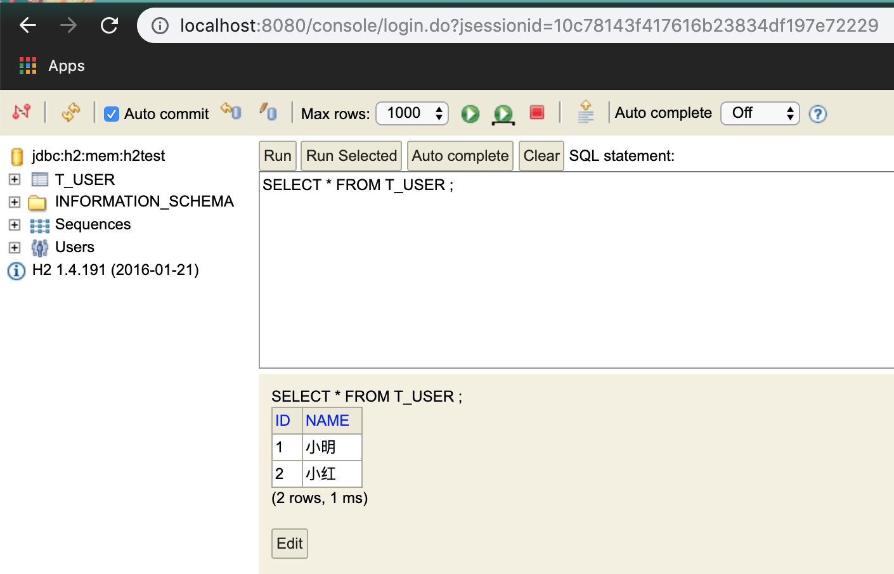
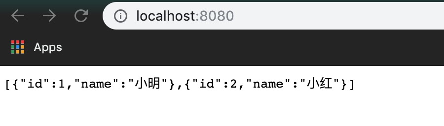

## H2 Database 练习

### 练习描述
- 编写配置application.yml文件，完成使用H2 Database所需相关配置依赖
- 打开http://localhost:8080/console进行登录，在T_USER中使用命令行添加数据，如下图

- 编写UserController文件，使用JPA对数据库内容进行查询，展示所有数据，例如，访问localhost:8080，显示如下内容

### 环境描述
- java8
- Intellij-IDEA
### 如何开始
- 克隆模版库,在resources/application.yml以及UserController文件中下完成需求

### 输出规范
- 完成需求的代码
- 项目根目录下必须包含运行截图